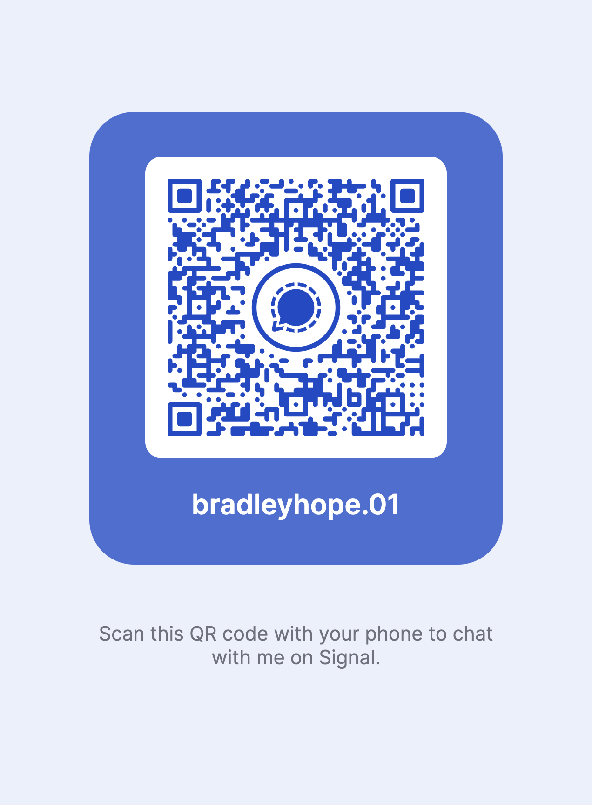

# Contact Bradley Hope securely

I’m a reporter based in London and co-founder of Project Brazen. If you have a story idea, information about wrongdoing, or something you think deserves investigation, I’d like to hear from you.

## Start with Signal

For confidential conversations, my preferred contact method is **Signal: bradleyhope.01**. Please begin with a brief description of what you would like to discuss, without documents or details that could identify you.

**[Message me on Signal](https://signal.me/#eu/Wxp6XU_YX7rv2P5TtfC3y9fV-36Aj-mDC-2wxLlzZJKgDMZWcM5Gj6tKvl6hX5Yn)**

You can use that link, scan the code below, or enter `bradleyhope.01` in Signal’s new-chat screen. You do not need to add my phone number to your contacts ([Signal’s username guide](https://signal.org/blog/phone-number-privacy-usernames/)).

If you do not already have Signal, download it from [signal.org](https://signal.org/). Signal encrypts messages and calls end to end, but still requires a phone number to register; using a username is not a guarantee of anonymity ([Signal’s username guide](https://signal.org/blog/phone-number-privacy-usernames/)).

## Before sending anything sensitive

- **Use a device you control.** Avoid a work phone, work computer, work email account or employer’s network for sensitive contact; SecureDrop’s [source guidance](https://docs.securedrop.org/en/stable/source/before_you_submit.html) explains the risks of employer-controlled equipment and networks.
- **Check what your Signal profile reveals.** Review your name, photograph and the settings under Privacy → Phone Number before making contact; “Who can see my number” and “Who can find me by my number” are separate controls ([Signal’s privacy guide](https://signal.org/blog/phone-number-privacy-usernames/)).
- **Do not send documents in your first message.** Files can contain identifying metadata, so start by describing the material in general terms rather than attaching it and then we will discuss next steps ([SecureDrop’s guidance on source-identifying metadata](https://docs.securedrop.org/en/stable/admin/deployment/landing_page.html)). 
- **Consider disappearing messages.** They reduce the conversation history left on devices, but do not prevent someone from copying or photographing a message ([Signal’s disappearing-message guidance](https://support.signal.org/hc/en-us/articles/360007320771-Set-and-manage-disappearing-messages)).

Encryption cannot protect messages on a device that someone else controls or has compromised. Keep your operating system and messaging app updated, and do not assume an encrypted conversation is safe on a monitored phone or computer ([Freedom of the Press Foundation’s device-security guidance](https://freedom.press/digisec/blog/signal-chats-cited-in-minneapolis-protest-indictment/)).

## If being identified could put you in serious danger

Do not assume that contacting me through Signal or email will keep you anonymous. Before sending anything, read [SecureDrop’s guidance for sources](https://docs.securedrop.org/en/stable/source/before_you_submit.html), which explains anonymous submission through Tor and precautions involving devices, networks and Tails.

This page does not provide a SecureDrop inbox. That guide is background on safer anonymous submission, not a way to send material to me.

## Email

For general correspondence, write to **bradley@projectbrazen.com**. Please use Signal rather than ordinary email to begin a sensitive conversation.

You can also reach us at **projectbrazen@protonmail.com**. Messages between Proton Mail accounts are end-to-end encrypted, but ordinary email sent from another provider is not automatically end-to-end encrypted, and subject lines and sender/recipient addresses are not protected in the same way as message contents ([Proton’s encryption explanation](https://proton.me/support/proton-mail-encryption-explained)). So the best process would be to create your own free Proton Mail account before messaging us.

Keep sensitive information out of email subject lines. 
